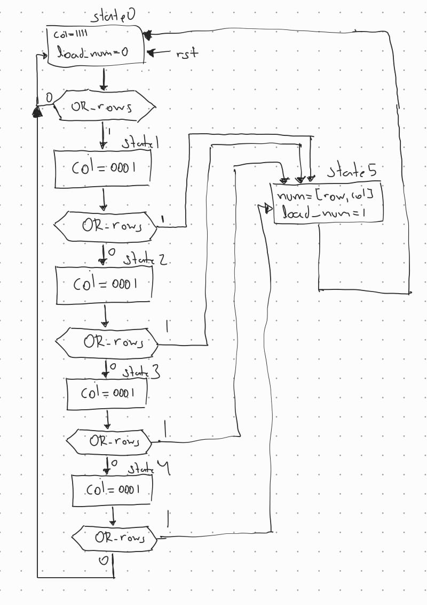
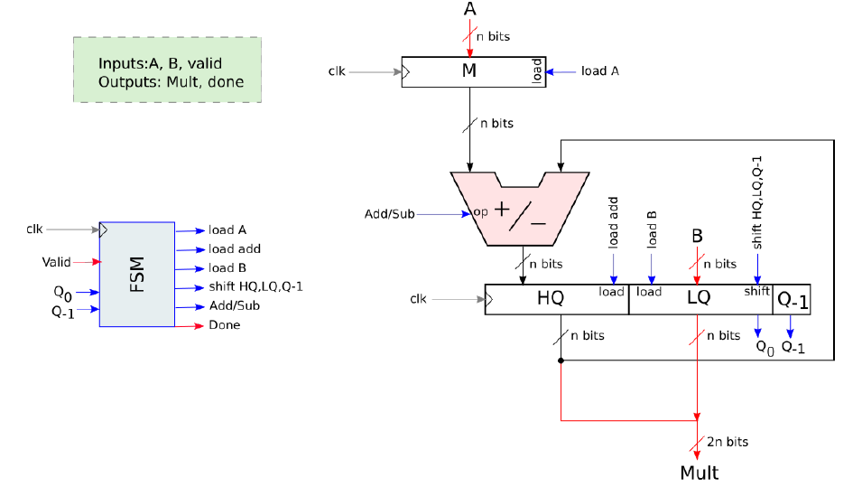

# Tarea 3: Algoritmo de Booth - Multiplicador con signo
## Estudiante: Dennis Manuel Arce Alvarez - 2018151568

## 0. Abreviaturas y definiciones
- **FPGA**: Field Programmable Gate Arrays
- **FSM**: Finite State Machine
- **BCD**: Binary Coded Decimal

## 1. Introducción
Para el diseño de sistemas digitales que implementan una cantidad considerables de algoritmos es necesario mantener un control lógico de las señales producidas por estas, de manera que se habilite un correcto flujo de datos.
Para este proyecto se buscó implementar esa práctica por medio del diseño de un algoritmo que pueda leer e interpretar un teclado matricial donde se introduzcan dos números y, estos, sean multiplicados por medio de un multiplicador basado en el Algoritmo de Booth.

## 2. Objetivos
- Diseñar un algortimo que reciba e interprete las señales de un teclado matricial
- Implementar el algoritmo de Booth con una Máquina de estados con técnicas avanzadas.
- Construir un subsistema de conversión de código binario a representación BCD.
- Crear un subsistema de despliegue de números por medio de display 7 segmentos.

## 3. Propuesta de Solución
### 3.0. Descripción general del sistema
El sistema es un multiplicador de 2 números de 3 dígitos con signo. El sistema recibe los números por medio de un teclado matricial, que luego son desplegados en displays 7 segmentos. El sistema cuenta con un botón de reseteo, para reiniciar los valores a un estado inicial.

### 3.1. Módulo 1 (Módulo Principal)
#### 3.1.1. Encabezado del módulo
```SystemVerilog
module MainModule(
    input logic clk,
    input logic rst, 
    input logic [3:0] row, 
    output logic [3:0] col,
    output logic [4:0] anodos,
    output logic [6:0] segmentos 
    );
```
#### 3.1.2. Parámetros
- Este módulo no cuenta con parametros

#### 3.1.3 Entradas y salidas:
- `clk`: Señal de entrada del reloj interno de la FPGA.
- `rst`: Señal de entrada de uno de los botones de la FPGA que funciona como reseteo a un valor inicial de los módulos.
- `row`: Señales de entrada que registran el estado de las filas del teclado matricial.
- `col`: Señales de salida que cambian el estado de las columnas del teclado matricial de bajo a alto.
- `anodos`: Señales de salida que se encargan de la función de los ánodos de los displays 7 segmentos.
- `segmentos`: Señales de salida que se encargan de cambiar los estados de alto a bajo, o viceversa, de los segmentos de los displays.

### 3.1.4. Criterios de diseño
Este módulo se enfoca en realizar las conexiones entre los distintos módulos que conforman el circuito.

#### 3.1.5. Testbench
El testbench realizado para este módulo buscó que los diferentes módulos del circuitos funcionaran de manera adecuada en conjunto. Para esto el testbench muestra los cambios en los módulos "Teclado", "Numeros", "mult_with_no_fsm" y "display" por medio de una secuencia de datos ingresados, simulando las entradas del teclado matricial.

### 3.2. Módulo 2 (Divisor de Frecuencia)
#### 3.2.1. Encabezado del módulo
```SystemVerilog
module FrecDivider(
    input logic clk,
    output logic clk_div 
    );
```
#### 3.2.2. Parámetros
- Este módulo no cuenta con parametros

#### 3.2.3 Entradas y salidas:
- `clk`: Señal de entrada del reloj interno de la FPGA.
- `clk_div`: Señal de salida de reloj a una menor frecuencia.

#### 3.2.4. Criterios de diseño
El módulo se realizó debido a que la lectura del teclado hexadecimal debe producirse alrededor de una frecuencia de 1 kHz, esto porque a mayores frecuencias el sistema no puede tomar la lectura del botón presionado o puede que se tomen múltiples lecturas.
El módulo utiliza un contador que se incrementa cada ciclo de "clk", y cuando el contador alcanza el valor de 27000, la señal de "clk_div" pasa a estar en alto y se reinicia el contador.

#### 3.2.5. Testbench
El testbench muestra contador, que simula los ciclos de reloj, e imprime en la terminal cuando ambas señales, clk y clk_div, están en alto.

### 3.3. Módulo 3 (Lectura de filas)
#### 3.3.1. Encabezado del módulo
```SystemVerilog
module Sincronizador(
    input logic clk_div,
    input logic rst,
    input logic [3:0] row,
    output logic [3:0] sync_row 
    );
```
#### 3.3.2. Parámetros
- Este módulo no cuenta con parametros

#### 3.3.3 Entradas y salidas:
- `clk_div`: Señal de entrada de reloj a una menor frecuencia.
- `rst`: Señal de entrada que resetea a un valor inicial el módulo.
- `row`: Señales de entrada que registran el estado de las filas del teclado matricial.
- `sync_row`: Señales de salida que registran el valor de "row" cada ciclo de "clk_div"

#### 3.3.4. Criterios de diseño
El módulo buscó eliminar el efecto de rebote mecánico producido al presionar los botones del teclado matricial. Para esto se utilizan dos flip-flops que cuando reciben la señal en alto de "clk_div", estos registran el valor de "row" a "sync_row"

#### 3.3.5. Testbench
El testbench muestra en la terminal de comandos el valor de "row", "sync_row" y "clk_div", y por medio de valores introducidos de "row" se visualizan los cambios pertinentes.

### 3.4. Módulo 4 (Lectura de Teclado)
#### 3.4.1. Encabezado del módulo
```SystemVerilog
module Teclado(
    input logic rst,
    input logic clk_div,
    input logic [3:0] sync_row,
    output logic [3:0] col,
    output logic [3:0] num,
    output logic load_num
    );
```
#### 3.4.2. Parámetros
- Este módulo no cuenta con parametros

#### 3.4.3 Entradas y salidas:
- `rst`: Señal de entrada que resetea a un valor inicial el módulo.
- `clk_div`: Señal de entrada de reloj a una menor frecuencia.
- `sync_row`: Señales de entrada que registraron el valor de "row" en ciclo de "clk_div"
- `col`: Señales de salida que cambian el estado de las columnas del teclado matricial.
- `num`: Registro del botón presionado del teclado hexadecimal.
- `load_num`: Señal que indica cuando se presionó un botón.

#### 3.4.4. Criterios de diseño
El módulo es una FSM, donde sus estados cambian el valor de "col" de manera que encienda una columna a la vez, y si una de las filas está en alto, cambiar el valor de "num" según los valores de "row" y "col", y pone en alto "load_num" para indicar que se tomó el valor del teclado.

#### 3.4.5. Testbench
El testbench simula los cambios de estado de las columnas y entradas diversas de las filas, mientras que en la terminal de comandos se despliengan los valores de "col", "row", "num" y "load_num".

### 3.5. Módulo 5 (Interpretación teclado)
#### 3.5.1. Encabezado del módulo
```SystemVerilog
module mi_modulo(
    input logic clk,
    input logic rst,
    input logic [3:0] num,
    input logic load_num,
    output logic [7:0] num_o,
    output logic [7:0] num_A, 
    output logic [7:0] num_B,
    output logic signal_num
    );
```
#### 3.5.2. Parámetros
- Este módulo no cuenta con parametros

#### 3.5.3 Entradas y salidas:
- `clk`: Señal de entrada del reloj interno de la FPGA.
- `rst`: Señal de entrada que resetea a un valor inicial el módulo.
- `num`: Señal de entrada con el valor del botón presionado.
- `load_num`: Señal de entrada que indica si hay un botón presionado.
- `num_o`: Señal de salida que registra el valor en BCD del número ingresado.
- `num_A`: Señal de salida que registra el valor del primer número.
- `num_B`: Señal de salida que registra el valor del segundo número.
- `signal_num`: Señal de salida que indica si ambos números fueron ingresados.

#### 3.5.4. Criterios de diseño
El módulo utiliza FSM para interpretar los registros ingresados por el teclado. Si el botón presionado es un número, la señal "num_o" registra el valor como BCD, y las señales "num_A" y "num_B" registran los valores como números binarios; si el botón presionado es el "A" cambia el signo del número; si es el botón "B", guarda el dígito y pasa al siguiente, además también sirve para confirmar el valor del primer y segundo número; y si es el botón "C", borra el dígito. Cuando se confirma el valor de B, el estado de "signal_num" cambia a alto, y funciona como bandera de "listo" para que se ejecute la operación de multiplicación.

#### 3.5.5. Testbench
El testbench recibe valores "num" que simulan las entradas del tecladoy en la terminal se muestran los cambios en las señales de "num_A", "num_B" y "num_o".

### 3.6. Módulo 6 (Control del multiplicador)
#### 3.6.1. Encabezado del módulo
```SystemVerilog
module control #(
    parameter n = 8
    ) (
    input logic clk,
    input logic rst,
    input logic signal_num,
    input logic [1:0] q_LSB,
    output logic load_A,
    output logic load_B,
    output logic load_add,
    output logic shift_HQ_LQ_Q_1,
    output logic add_sub
    );
```
#### 3.6.2. Parámetros
- `n`: Parámetro que indica el número de bits del número.

#### 3.6.3 Entradas y salidas:
- `clk`: Señal de entrada del reloj interno de la FPGA.
- `rst`: Señal de entrada que resetea a un valor inicial el módulo.
- `signal_num`: Señal de entrada de la señal de listo del ingreso de los números
- `q_LSB`: Señal de entrada del  bit menos significativo del registro de la operación de multiplicación
- `load_A`: Señal de salida que indica cuando cargar el valor de "A"
- `load_B`: Señal de salida que indica cuando cargar el valor de "B"
- `load_add`: Señal de salida que indica cuando cargar el valor de la suma dentro del algoritmo.
- `shift_HQ_LQ_Q_1`: Señal de salida que indica cuando realiza el shift a las señales.
- `add_sub`: Señal de salida que indica cuando realizar la operación de suma dentro del algoritmo.

#### 3.6.4. Criterios de diseño
El módulo funciona como control del módulo del multiplicador. Utiliza FSM para controlar los estados y las operacionees que realiza el multiplicador. El control se inicia cuando la señal "signal_num" esté en alto

### 3.7. Módulo 7 (Multiplicador)
#### 3.7.1. Encabezado del módulo
```SystemVerilog
module mult_with_no_fsm #(
    parameter N = 8
    ) (
    input logic clk ,
    input logic rst ,
    input logic [N-1:0] A,
    input logic [N-1:0] B,
    input logic load_A,
    input logic load_B,
    input logic load_add,
    input logic shift_HQ_LQ_Q_1,
    input logic add_sub,
    output logic [1:0] Q_LSB,
    output logic [2*N-1:0] Y
) ;
```
#### 3.7.2. Parámetros
- `N`: Parámetro que indica el número de bits de los números ingresados.

#### 3.7.3 Entradas y salidas:
- `clk`: Señal de entrada del reloj interno de la FPGA.
- `rst`: Señal de entrada que resetea a un valor inicial el módulo.
- `A`: Señal de entrada que toma el valor del primer número.
- `B`: Señal de entrada que toma el valor del segundo número.
- `load_A`: Señal de entrada que indica cuando cargar el valor de "A"
- `load_B`: Señal de entrada que indica cuando cargar el valor de "B"
- `load_add`: Señal de entrada que indica cuando cargar el valor de la suma dentro del algoritmo.
- `shift_HQ_LQ_Q_1`: Señal de entrada que indica cuando realiza el shift a las señales.
- `add_sub`: Señal de salida que indica cuando realizar la operación de suma dentro del algoritmo.
- `Q_LSB`: Señal de entrada del bit menos significativo del registro de la operación de multiplicación
- `Y`: Señal de salida con el resultado de la multiplicación.

#### 3.7.4. Criterios de diseño
Multiplicador basado en el Algoritmo de booth (ref codif)

#### 3.7.5. Testbench
El testbench se realizó en conjunto con el módulo de control, se simularon la entrada de dos números para las señales "A" y "B", se puso la señal "signal_num" en alto luego de 10 ciclos de reloj mientras se monitoreaban las señales del algoritmo de Booth, e imprime el resultado de la operación de multiplicación.

### 3.8. Módulo 8 (Conversor Binario a BCD)
#### 3.8.1. Encabezado del módulo
```SystemVerilog
module bin_decimal (
    input [15:0] binario,
    output reg [15:0] bcd
);
```
#### 3.8.2. Parámetros
- Este módulo no cuenta con parametros

#### 3.8.3 Entradas y salidas:
- `binario`: Señal de entrada del resultado de la multiplicación.
- `bcd`: Señal de salida del valor convertido a BCD.

#### 3.8.4. Criterios de diseño
El módulo transforma el resultado de la multiplicación de binario a BCD para luego ser desplegado en los displays 7 segmentos.

#### 3.8.5. Testbench
El testbench realiza una prueba con un número ingresado en binario y en la terminal muestra la comparación entre ese número y el resultado de la conversión.

### 3.9. Módulo 9 (Displays 7 Segmentos)
#### 3.9.1. Encabezado del módulo
```SystemVerilog
module display (
    input logic clk,
    input logic load_num,
    input logic [15:0] num,
    output logic [4:0] anodos,
    output logic [6:0] segmentos
);
```
#### 3.9.2. Parámetros
- Este módulo no cuenta con parametros

#### 3.9.3 Entradas y salidas:
- `clk`: Señal de entrada del reloj interno de la FPGA.
- `load_num`: Señal de entrada que indica el cambio de número desplegado..
- `num`: Señal de entrada con el número a desplegar
- `anodos`: Señales de salida que se encargan de la función de los ánodos de los displays 7 segmentos.
- `segmentos`: Señales de salida que se encargan de cambiar los estados de alto a bajo, o viceversa, de los segmentos de los displays.

#### 3.9.4. Criterios de diseño
La  función del módulo es la de visualizar los cambios del sistema de manera física por medio de los displays 7 segmentos. Cada ciclo de reloj cambia el estado de "anodos" para que encienda el 7 segmentos correspondiente, y el estado de "segmentos" cambia cuando la señal "load_num" esté en alto y el valor depende de "num", el cual será correspondiente al número ingresado.

#### 3.9.5. Testbench
El testbench recibe un número negativo de 4 dígitos, mientras que se visuualiza en la terminal los cambios en "anodos" y "segmentos".

## 4. Análisis de Resultados
### 4.1 Consumo de recursos
```
=== MainModule ===

   Number of wires:               1518
   Number of wire bits:           3130
   Number of public wires:        1518
   Number of public wire bits:    3130
   Number of memories:               0
   Number of memory bits:            0
   Number of processes:              0
   Number of cells:               1792
     ALU                           329
     DFF                            17
     DFFN                            7
     DFFNCE                         17
     DFFR                           28
     DFFS                            6
     GND                             1
     IBUF                            6
     LUT1                          476
     LUT2                           79
     LUT3                           81
     LUT4                          182
     MUX2_LUT5                     341
     MUX2_LUT6                     157
     MUX2_LUT7                      40
     MUX2_LUT8                       8
     OBUF                           16
     VCC                             1
```

```
Info: Device utilisation:
Info: 	                 VCC:     1/    1   100%
Info: 	               SLICE:  1361/ 8640    15%
Info: 	                 IOB:    22/  274     8%
Info: 	                ODDR:     0/  274     0%
Info: 	           MUX2_LUT5:   341/ 4320     7%
Info: 	           MUX2_LUT6:   157/ 2160     7%
Info: 	           MUX2_LUT7:    40/ 1080     3%
Info: 	           MUX2_LUT8:     8/ 1056     0%
Info: 	                 GND:     1/    1   100%
Info: 	                RAMW:     0/  270     0%
Info: 	                 GSR:     1/    1   100%
Info: 	                 OSC:     0/    1     0%
Info: 	                rPLL:     0/    2     0%
```

En base a los datos obtenidos, se puede apreciar que el circuito es extenso y ocupa una gran cantidad de cables para interconectar los módulos, además de utilizar una gran cantidad de celdas, las cuales se encargan de las funciones lógicas del circuito.

```
Info: Max frequency for clock              'Frec.clk': 84.79 MHz (PASS at 27.00 MHz)
Info: Max frequency for clock 'ctrl.state_DFFN_Q_CLK': 186.05 MHz (PASS at 27.00 MHz)
```

Con respecto a las máximas frecuencias de reloj del circuito, se notan un gran desfase de las mismas lo cual provocó que nunca se sincronizaran los relojes dentro del circuito y de ahí ocasionó el problema de asincronía.

### 4.2 Prueba del prototippo
El prototipo cuenta con el teclado matricial, 5 transistores 2N2222, 5 displays 7 segmentos, una FPGA Tangnano 9k y resistencias correpondientes para controlar la corriente. En teoría, al presionar los botones del teclado, los displays deberían reflejar los cambios, lo cual no fue el caso. Esto pudo ser provocado por problemas de "timing" dentro de los módulos del circuito. Los displays al no recibir valores toman un valor por defecto de 0, lo cual provoca que un 0 en cada uno de los displays. El botón de "rst", apaga los displays 1 segundo antes de que vuelvan al valor inicial.

## 5. Conclusiones
El sistema en conjunto no funcionó de la manera esperada. El sistema no lee de manera correcta las señales producidas por el teclado matricial, de manera que las señales que se encargan de llevar los números tienen un valor indefinido, y por lo tanto, no puede realizar la multiplicación. Estos problemas fueron ocasionados principalmente por una asincronía entre los módulos, de manera que los módulos no comunican de manera correcta.
Una posible solución a este problema puede ser implementar una módulo de control controlado por una FSM donde cada estado activa el módulo correspondiente, y, solo cambia el mismo hasta que módulo actual envíe la señal indicada.

## 6. Problemas encontrados durante el proyecto
- Se encontraron múltiples errores de sincronía entre los módulos producidos por las señales "clk" y "clk_div".
- Con respecto a la lectura del teclado, los estados de la FSM estuvieron mal planteados y se mantenía en bucle la lectura en una única columna.
- Se encontraron errores al definir la cantidad de bits de las señales que llevan los números.
- Se implementaron señales que indican que un sistema acabó su operación, debido a que los módulos se ejecutan todo el tiempo incluso sin tener señales con las que trabajar.
- Hubo una mala organización del tiempo de trabajo en el proyecto.

## 7. Referencias
[0] David Harris y Sarah Harris. *Digital Design and Computer Architecture. RISC-V Edition.* Morgan Kaufmann, 2022. ISBN: 978-0-12-820064-3
[1] Dr. Ing. Alfonso Chacón-Rodriguez. *Tarea III: Algoritmo de Booth - Multiplicador con signo*, 2024. Recuperado de: https://tecdigital.tec.ac.cr/dotlrn/classes/E/EL3307/S-2-2024.CA.EL3307.1/file-storage/#/188142958 

## Apendices:
### Apendice 1:
Diagrama de Estados del módulo de Lectura del Teclado.


### Apendice 2:
Diagrama de Bloques del Algoritmo de Booth. [1]


### Apendice 3:
Diagrama de Estados del Algoritmo de Booth.


### Apendice 1:
texto, imágen, etc
